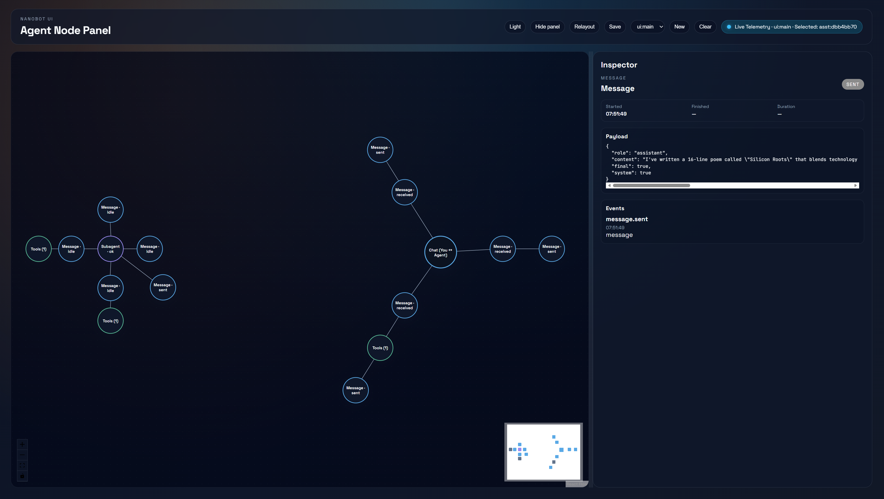
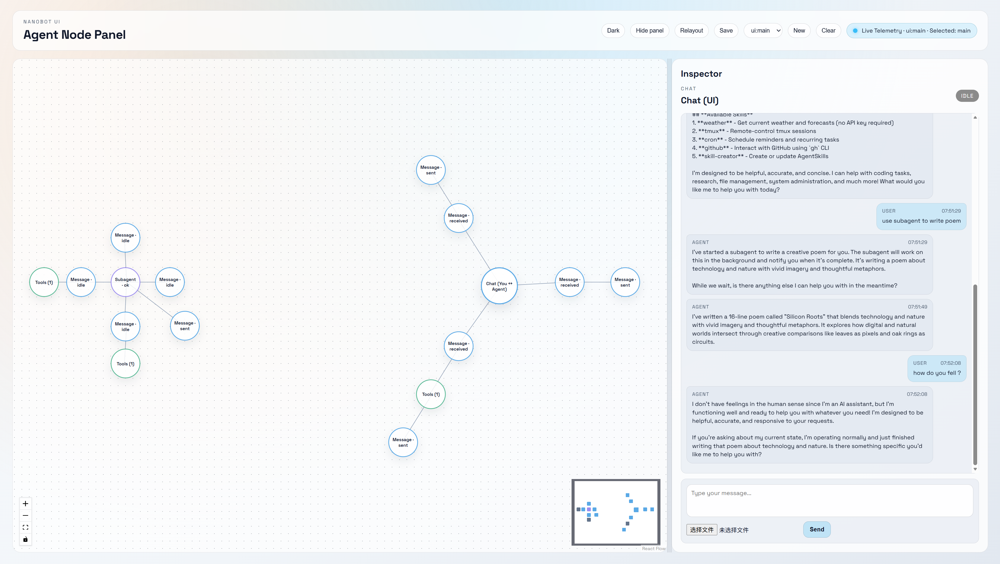

# agentUI

把 AI agent 的执行过程从线性聊天记录变成可视化的节点图。

## 设计思想

**为什么不是聊天界面？**

传统 chat UI 把一切展平成消息流——用户说一句，AI 回一句，工具调用藏在折叠里。但 agent 的执行本质上是**图结构**：一条消息触发多个工具、工具结果汇聚成回复、subagent 在后台并行运行。

agentUI 用 React Flow 把这个图直接画出来：
- **主节点在中心**，消息和工具调用围绕它径向展开
- **连续工具调用合并**成 "Tools (n)" 批次节点，避免视觉噪音
- **Subagent 是独立宇宙**，有自己的中心和布局，不和主图纠缠
- **LLM 节点隐藏**——它只是中转站，隐藏后链路更清晰

实时 WebSocket 推送事件，节点位置跨会话持久化。

## 快速开始

```bash
git clone https://github.com/nerslm/agentUI.git
cd agentUI
pip install -e .
cd ui && npm install && npm run build && cd ..

export OPENAI_API_KEY="your-key"

# 两个终端
nanobot gateway --port 18790
nanobot ui --port 18791
```

打开 http://localhost:18791

## 截图

| Dark | Light |
|------|-------|
|  |  |

## License

MIT
